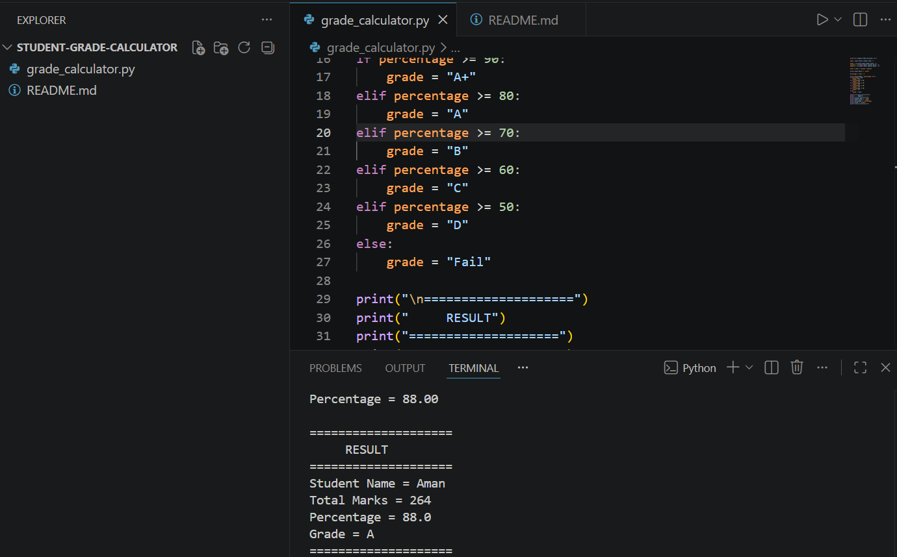

# Student Grade Calculator

A beginner-friendly Python project that calculates student grades based on marks.

## Features

- User input
- Total marks calculation
- Percentage calculation
- Grade calculation (A+, A, B, C, D, Fail)
- Clean result display

## Technologies Used

- Python

## How to Run

1. Open terminal
2. Run:

```bash
python grade_calculator.py
```

## Author

Naman Pradhan

## Sample Output

